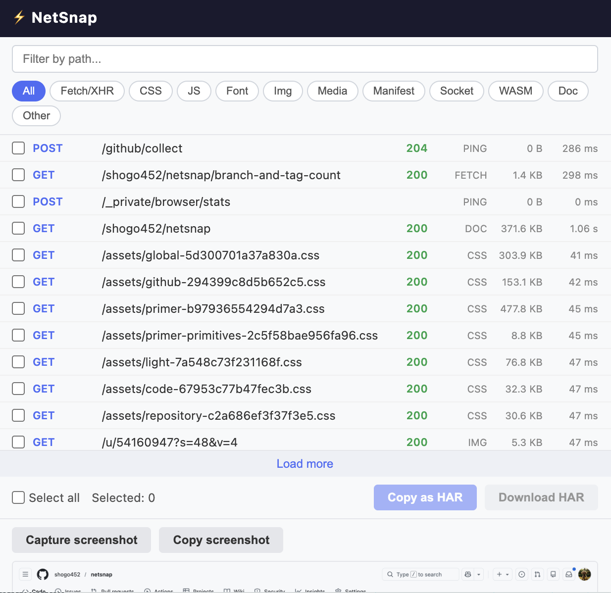

# NetSnap

A Chrome extension that captures network requests in HAR format and takes screenshots with one click.

Chrome DevTools lets you export all requests as HAR, but there is no built-in way to export just a few selected requests. NetSnap solves this by letting you pick exactly the requests you need and copy or download them as a standard HAR file.

<p align="center">
  
</p>

## Features

- **Network Request Capture** — Records HTTP/HTTPS requests via Chrome DevTools API in real-time
- **HAR Copy & Download** — Copy selected requests to clipboard or download as a `.har` file (HAR 1.2)
- **Filtering** — Filter by path or resource type (All, Fetch/XHR, CSS, JS, Font, Img, Media, Manifest, Socket, WASM, Doc, Other)
- **Screenshot Capture** — Captures the visible viewport as a PNG and copies it to clipboard
- **Page Reload** — Reload the current page from the popup without closing it
- **Request Details** — Displays method, path, status code, type, size, and duration for each request

## Installation

1. Clone or download this repository
2. Open `chrome://extensions` in Chrome
3. Enable **Developer mode** (top-right toggle)
4. Click **Load unpacked** and select the project directory
5. The NetSnap icon will appear in the Chrome toolbar

## Usage

1. Open Chrome DevTools (F12 or Cmd+Option+I on Mac) — this is required for network capture
2. Browse or reload the page to start capturing requests
3. Click the NetSnap icon in the toolbar to open the popup
4. Filter by path or resource type, then select the requests you need
5. Click **Copy as HAR** to copy to clipboard, or **Download HAR** to save as a file
6. Use **Capture screenshot** to take a screenshot of the current page

## Architecture

```
devtools.js       Captures network requests via chrome.devtools.network API
background.js     Service worker that handles screenshot capture and tab reload
popup.html/js/css Popup UI for viewing, filtering, and exporting data
```

**Data flow:**

```
DevTools API → devtools.js → chrome.storage.local → popup.js → Clipboard / File
```

## Limitations

- Chrome DevTools must be open for network capture to work
- Screenshots capture only the visible viewport (not full-page)
- Response bodies are excluded from HAR export to conserve storage
- Maximum of 2000 network entries are stored at a time

## License

All rights reserved.
